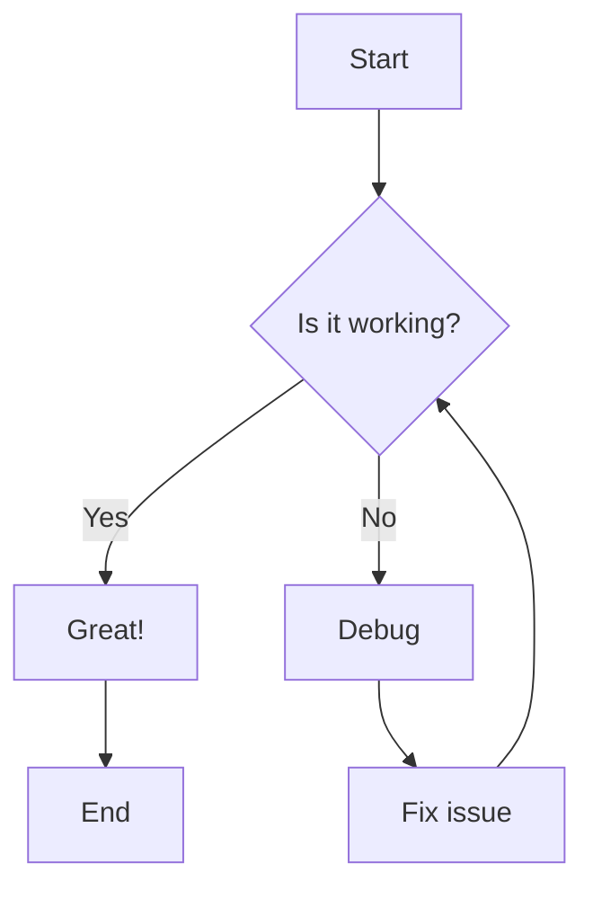
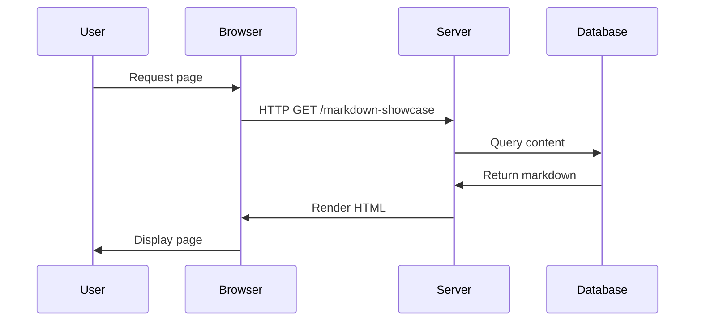
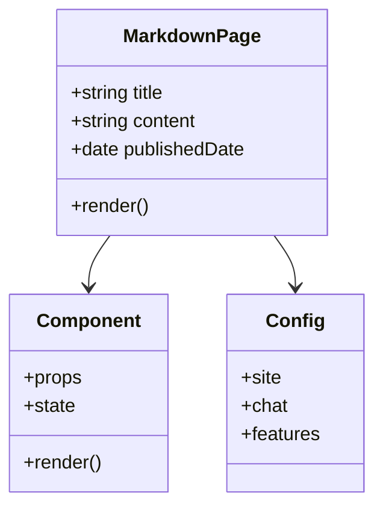

# Markdown Showcase

This page showcases SuperSite's comprehensive markdown rendering capabilities. It demonstrates all supported markdown elements with real examples.

## Overview

SuperSite supports a full range of markdown features:
- Lists (bulleted, numbered, nested, mixed)
- Checkboxes and todo items
- Blockquotes and nested quotes
- Code blocks with syntax highlighting
- Tables with various alignments
- Links (standard, reference-style, auto-detected)
- Interactive elements (collapsible sections, Mermaid diagrams)
- Mixed complex content structures

---

## Lists

### Unordered Lists (Dash)

- First item with dash
- Second item with dash
- Third item with dash
  - Nested item level 1
  - Another nested item level 1
    - Nested item level 2
    - Another nested item level 2
- Fourth item back at root level

### Unordered Lists (Asterisk)

* First item with asterisk
* Second item with asterisk
* Third item with asterisk
  * Nested item level 1
  * Another nested item level 1
    * Nested item level 2
    * Another nested item level 2
* Fourth item back at root level

### Ordered Lists

1. First numbered item
2. Second numbered item
3. Third numbered item
   1. Nested numbered item A
   2. Nested numbered item B
      1. Deeply nested item
      2. Another deeply nested item
4. Fourth numbered item

### Mixed Nested Lists

1. Ordered item one
   - Unordered nested under ordered
   - Another unordered nested
     * Different bullet nested deeper
     * More nested items
2. Ordered item two
   * Asterisk nested under ordered
   * More asterisk items
     1. Numbered nested under unordered
     2. More numbered items
3. Ordered item three

---

## Checkboxes (Todo Items)

### Simple Todo List

- [ ] Unchecked task one
- [ ] Unchecked task two
- [x] Checked task one
- [x] Checked task two
- [ ] Unchecked task three

### Nested Todo List

- [ ] Main task 1
  - [ ] Subtask 1.1
  - [x] Subtask 1.2 (completed)
  - [ ] Subtask 1.3
- [x] Main task 2 (completed)
  - [x] Subtask 2.1 (completed)
  - [x] Subtask 2.2 (completed)
- [ ] Main task 3
  - [x] Subtask 3.1 (completed)
  - [ ] Subtask 3.2

---

## Blockquotes

### Simple Blockquote

> This is a simple blockquote with a single line.

### Multi-line Blockquote

> This is a multi-line blockquote.
> It spans multiple lines and should be rendered
> with consistent indentation and styling.
> All lines should appear in the quote block.

### Blockquote with Formatting

> **Bold text** and *italic text* and `inline code`
>
> This quote contains multiple formatting styles including [links](https://example.com) and other markdown elements.

### Nested Blockquotes

> This is the first level quote.
>
> > This is a nested quote inside the first quote.
> > It should be indented further.
> >
> > > This is a deeply nested quote.
> > > Three levels deep.
>
> Back to the first level quote.

### Blockquote with Lists

> **Important Note:**
>
> - First item in quote
> - Second item in quote
> - Third item in quote
>
> Remember these points when working with markdown.

---

## Code Blocks

### JSON

```json
{
  "name": "SuperSite",
  "version": "1.0.0",
  "description": "AI-powered website template",
  "features": [
    "markdown",
    "chat",
    "themes",
    "multilingual"
  ],
  "config": {
    "enabled": true,
    "count": 42,
    "nested": {
      "deep": "value"
    }
  }
}
```

### YAML

```yaml
site:
  name: SuperSite
  version: 1.0.0
  description: AI-powered website template

features:
  - markdown
  - chat
  - themes
  - multilingual

config:
  enabled: true
  count: 42
  nested:
    deep: value
```

### Bash / Shell

```bash
#!/bin/bash

# Install dependencies
npm install

# Run development server
npm run dev

# Build for production
npm run build && npm run start

# Run tests
npm test
```

### XML

```xml
<?xml version="1.0" encoding="UTF-8"?>
<site>
  <name>SuperSite</name>
  <version>1.0.0</version>
  <features>
    <feature>markdown</feature>
    <feature>chat</feature>
    <feature>themes</feature>
  </features>
  <config enabled="true">
    <count>42</count>
  </config>
</site>
```

### Markdown (Meta-Example)

```markdown
# Heading 1
## Heading 2
### Heading 3

**Bold text** and *italic text* and `inline code`

- Unordered list
- Another item

1. Ordered list
2. Another item

[Link text](https://example.com)

> A blockquote

\`\`\`javascript
const code = "example";
\`\`\`
```

### Inline Code

Here is some `inline code` within a sentence. You can use `variables`, `function()` calls, and `file-paths.js` inline with the text.

Multiple inline code blocks: `const x = 1` and `const y = 2` and `const z = x + y`.

---

## Tables

### Simple Table

| Column 1 | Column 2 | Column 3 |
|----------|----------|----------|
| Row 1A   | Row 1B   | Row 1C   |
| Row 2A   | Row 2B   | Row 2C   |
| Row 3A   | Row 3B   | Row 3C   |
| Row 4A   | Row 4B   | Row 4C   |

### Table with Alignment

| Left Aligned | Center Aligned | Right Aligned |
|:-------------|:--------------:|--------------:|
| Left         | Center         | Right         |
| Text         | Text           | Text          |
| 100          | 200            | 300           |
| Short        | Medium Length  | Very Long     |

### Table with Long Content

| Feature | Description | Status |
|---------|-------------|--------|
| Markdown Rendering | Full support for GitHub-flavored markdown including tables, lists, code blocks, and more | ✅ Complete |
| Syntax Highlighting | Code blocks with syntax highlighting for 20+ languages using rehype-highlight | ✅ Complete |
| Responsive Design | Mobile-first design that adapts to all screen sizes from phones to desktops | 🚧 In Progress |
| AI Chat Integration | Intelligent chatbot powered by Claude, GPT, Gemini, or local Ollama | ✅ Complete |

### Table with Formatting

| **Element** | **Syntax** | **Example** |
|-------------|------------|-------------|
| Bold | `**text**` | **Bold text** |
| Italic | `*text*` | *Italic text* |
| Code | `` `code` `` | `inline code` |
| Link | `[text](url)` | [Example](https://example.com) |
| Strikethrough | `~~text~~` | ~~Strikethrough~~ |

### Table with Mixed Content

| Type | Code Example | Notes |
|------|--------------|-------|
| String | `"Hello World"` | Text data |
| Number | `42`, `3.14` | Numeric values |
| Boolean | `true`, `false` | True/False values |
| Array | `[1, 2, 3]` | List of items |
| Object | `{ "key": "value" }` | Key-value pairs |

---

## Links

### Standard Links

[SuperSite Documentation](https://github.com/coachsteff/supersite)

[OpenAI](https://openai.com)

[Anthropic](https://anthropic.com)

[Google](https://google.com)

### Links with Titles (Hover Tooltips)

[SuperSite GitHub](https://github.com/coachsteff/supersite "View the SuperSite repository on GitHub")

[Next.js Documentation](https://nextjs.org/docs "Official Next.js documentation")

[TypeScript Handbook](https://www.typescriptlang.org/docs/handbook/ "Learn TypeScript")

### Reference-Style Links

Here is a [reference link to SuperSite][1] and another [reference link to Next.js][2].

You can also use [numbered references][3] or [named references][nextjs].

[1]: https://github.com/coachsteff/supersite "SuperSite Repository"
[2]: https://nextjs.org "Next.js Framework"
[3]: https://react.dev "React Documentation"
[nextjs]: https://nextjs.org/docs "Next.js Docs"

### Automatic URL Detection

https://github.com/coachsteff/supersite

https://nextjs.org

https://www.anthropic.com

### Links That May Trigger Previews

**GitHub Repository:**
https://github.com/vercel/next.js

**YouTube Video:**
https://www.youtube.com/watch?v=dQw4w9WgXcQ

**Twitter/X Post:**
https://twitter.com/example/status/123456789

**Stack Overflow Question:**
https://stackoverflow.com/questions/123456/example-question

---

## Interactive Elements

### Collapsible Sections (HTML Details Tag)

> **Note:** Standard markdown doesn't natively support collapsible sections, but HTML `<details>` tags may work if HTML is allowed in the markdown processor.

<details>
<summary>Click to expand this section</summary>

This is hidden content that appears when you click the summary.

You can include **markdown formatting** inside details tags:

- List item 1
- List item 2
- List item 3

```javascript
const example = "code block inside details";
console.log(example);
```

</details>

<details>
<summary>Another collapsible section with a table</summary>

| Column A | Column B |
|----------|----------|
| Data 1   | Data 2   |
| Data 3   | Data 4   |

And some text after the table.

</details>

### Mermaid Diagrams

> **Note:** Mermaid diagram support requires additional setup. If not configured, these will appear as code blocks. To enable, install `remark-mermaid` or use client-side Mermaid.js.

#### Flow Diagram



#### Sequence Diagram



#### Class Diagram



---

## Mixed Complex Content

This section demonstrates complex nested structures combining multiple markdown elements.

### Project Setup Checklist

1. **Initial Setup**
   - [ ] Clone the repository
   - [ ] Install Node.js dependencies
   
   ```bash
   git clone https://github.com/coachsteff/supersite.git
   cd supersite
   npm install
   ```
   
   - [x] Configure environment variables
   - [ ] Review configuration file

2. **Configuration**
   
   > **Important:** Make sure to update your configuration file before proceeding with deployment.
   
   | Config Key | Default Value | Required |
   |------------|---------------|----------|
   | `SITE_NAME` | `SuperSite` | Yes |
   | `API_KEY` | - | Yes |
   | `DEBUG` | `false` | No |
   
   Edit `config/site.yaml`:
   
   ```yaml
   site:
     name: Your Site Name
     url: https://your-domain.com
   ```

3. **Development & Testing**
   - [x] Run development server with `npm run dev`
   - [x] Test in browser at [http://localhost:3000](http://localhost:3000)
   - [ ] Run test suite
   - [ ] Check accessibility
   
   See the [testing documentation](https://github.com/coachsteff/supersite/blob/main/docs/TESTING.md) for more details.

4. **Deployment**
   - [ ] Build production version
   - [ ] Deploy to hosting platform
   - [ ] Verify live site
   - [ ] Monitor for errors

### Feature Comparison

> Here's how SuperSite compares to other solutions:

| Feature | SuperSite | Traditional CMS | Static Site |
|---------|-----------|-----------------|-------------|
| AI Chat | ✅ Built-in | ❌ Plugin required | ❌ Not available |
| Markdown | ✅ Native | ⚠️ Limited | ✅ Full support |
| Configuration | ✅ YAML-based | ❌ Database | ⚠️ Code-based |
| Deployment | ✅ Simple | ⚠️ Complex | ✅ Simple |
| Performance | ✅ Excellent | ⚠️ Variable | ✅ Excellent |

**Legend:** ✅ Excellent | ⚠️ Partial | ❌ Not supported

---

## Horizontal Rules

Different horizontal rule syntaxes:

Three dashes:

---

Three asterisks:

***

Three underscores:

___

---

## Additional Markdown Elements

### Strikethrough

This text is normal, ~~this text is struck through~~, and this text is normal again.

You can combine ~~strikethrough~~ with **bold** and *italic* and `code`.

### Emoji

Plain text emoji characters:

- 🚀 Rocket
- ✅ Check mark
- ❌ Cross mark
- ⚠️ Warning
- 💡 Light bulb
- 📝 Memo
- 🎨 Art palette
- 🔧 Wrench
- 📦 Package
- 🌟 Star

### Escaping Markdown Characters

To display literal markdown characters, escape them with backslash:

- Asterisks: \*not italic\* instead of *italic*
- Underscores: \_not italic\_ instead of _italic_
- Backticks: \`not code\` instead of `code`
- Brackets: \[not a link\](url) instead of [link](url)
- Hash: \# Not a heading

### Subscript and Superscript

Standard markdown doesn't support subscript/superscript, but HTML tags may work:

- H<sub>2</sub>O (water molecule)
- E = mc<sup>2</sup> (Einstein's equation)
- X<sup>n</sup> + Y<sup>n</sup> = Z<sup>n</sup>

---

## Summary

This page showcases SuperSite's comprehensive markdown capabilities. All elements are rendered using the existing markdown pipeline (`react-markdown`, `remark`, `rehype-highlight`) without additional configuration.

**Supported Features:**
- ✅ Full GitHub-flavored markdown
- ✅ Syntax highlighting for 20+ languages
- ✅ Tables with alignment options
- ✅ Nested lists and mixed content
- ✅ Blockquotes with formatting
- ✅ Multiple link formats
- ⚠️ HTML elements (if allowed by configuration)
- ⚠️ Mermaid diagrams (requires additional setup)

**Next Steps:**
- View this page at `/markdown-showcase`
- Test responsiveness across devices
- Verify dark/light mode rendering
- Try interactive elements

For more information, see the [SuperSite documentation](https://github.com/coachsteff/supersite).
