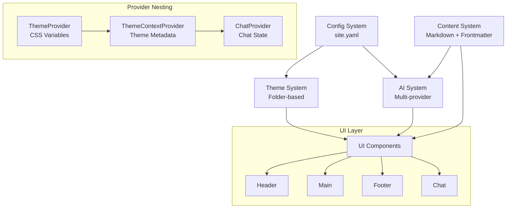

# SuperSite Architecture

> Last updated: 2026-03-15 | Version: 0.3.0

## Overview

SuperSite is an AI-first Next.js framework with configuration-driven content management and a modular theme system. It provides a complete website template that can be customized entirely through YAML configuration files and markdown content, with no code changes required.

## Architecture Diagram


```mermaid
graph TB
    Config[Config System<br/>site.yaml] --> Theme[Theme System<br/>Folder-based]
    Config --> AI[AI System<br/>Multi-provider]
    Content[Content System<br/>Markdown + Frontmatter] --> AI
    Theme --> UI[UI Components]
    AI --> UI
    Content --> UI
    
    subgraph "UI Layer"
        UI --> Header
        UI --> Main
        UI --> Footer
        UI --> Chat
    end
    
    subgraph "Provider Nesting"
        ThemeProvider[ThemeProvider<br/>CSS Variables]
        ThemeCtx[ThemeContextProvider<br/>Theme Metadata]
        ChatProv[ChatProvider<br/>Chat State]
        ThemeProvider --> ThemeCtx
        ThemeCtx --> ChatProv
    end
```

## Core Systems

### 1. Configuration System

**Location**: `lib/config.ts`

**Format**: YAML with dual-config support
- `config/site.yaml` - Template configuration (git-tracked)
- `config/site.local.yaml` - User overrides (git-ignored, optional)

**Features**:
- Deep merge: User config overrides template defaults
- Zod validation for type safety
- Hot reload in development mode
- No caching in dev, cached in production

**Key Functions**:
- `getSiteConfig()` - Loads and merges configuration
- `getClientSafeConfig()` - Returns client-safe subset of config
- `getActiveTheme()` - Loads and returns the active theme

### 2. Theme System (Folder-Based)

**Location**: `lib/theme-system/`

**Structure**: Each theme is a folder containing 4 YAML files:
```
themes/base/
├── theme.yaml       # Metadata + feature toggles
├── structure.yaml   # Layout structure (header, footer, sidebar)
├── blocks.yaml      # Content blocks and widgets
└── colors.yaml      # Colors, fonts, spacing
```

**Built-in Themes**:
1. **base** - General starting point with all standard features
2. **blog** - Content-first for writers and publishers
3. **influencer** - Personal branding, link-in-bio style
4. **business** - Conversion-focused for products/services
5. **community** - Learning and engagement platform
6. **chatbot** - AI-first conversational interface

**Custom Themes**:
- Location: `themes-custom/` (git-ignored)
- Naming: Use `custom/my-theme` in config to reference

**Key Functions**:
- `loadTheme(name)` - Loads a theme by name
- `applyThemeOverrides(theme, overrides)` - Applies config overrides

**Type**: `FullTheme` contains:
```typescript
{
  meta: { name, version, features },
  colors: { light, dark },
  typography: { fonts, sizes },
  spacing: { xs, sm, md, lg, xl, xxl },
  layout: { borderRadius, maxWidth },
  structure: { header, footer, navigation, hero, layout },
  blocks: { sidebar, sections, footerWidgets }
}
```

### 3. Content Management

**Location**: `lib/markdown.ts`

**Dual-Directory System**:
- `content/` - Template content (git-tracked)
- `content-custom/` - User content (git-ignored, default location)
- Priority: `content-custom/` → `content/`

**Content Types**:
- **Pages**: `content/pages/**/*.md` → URL structure
- **Blog Posts**: `content/blog/YYYY-MM-DD-slug.md`

**Features**:
- Markdown processing with `remark` and `remark-html`
- YAML frontmatter with `gray-matter`
- Auto-generated navigation from folder structure
- SEO metadata extraction
- AI chat context building

**Key Functions**:
- `getAllPages()` - Returns all pages
- `getAllBlogPosts()` - Returns all blog posts sorted by date
- `getBlogPostBySlug(slug)` - Gets a single blog post
- `getAllTags()` - Returns tags with counts
- `getAllCategories()` - Returns categories with counts
- `getRecentBlogPosts(limit)` - Returns recent posts
- `getFolderStructure()` - Builds navigation tree

### 4. Markdown Directives System

**Location**: `lib/remarkDirectives.ts`, `components/directives/`

**Pipeline**: Content markdown is processed through `remark-directive` which parses directive syntax into AST nodes. `remarkDirectives.ts` transforms these AST nodes into HTML with data attributes. `MarkdownContent.tsx` then maps the rendered HTML elements to React components via `div` and `span` switch cases.

**23 Directives** across 4 categories:
- **Container** (7): `details`, `tabs`/`tab`, `card`, `steps`, `formula`, `flow`, `section`
- **Leaf** (4): `youtube`, `button`, `spacer`, `divider`, `stat`, `connector`
- **Text/Inline** (4): `highlight`, `badge`, `kbd`, `abbr`
- **Infographic** (6): `formula-card`, `flow-step`, `info-card`, `connector`, `stat`, `section`

**Styling**: All directive styles in `styles/Directives.module.css`. Infographic directives support named accent colors (cyan, teal, green, orange, yellow, purple, red, blue, pink).

### 5. Hashtag and Tagging System

**Location**: `lib/remark-hashtags.ts`, `lib/markdown.ts`

**Pipeline**: The `remark-hashtags` plugin runs during markdown processing and transforms `#TagName` patterns into `<a href="/tags/tag-name" class="hashtag">` links. Tags are normalized to lowercase kebab-case.

**Dual Sources**: Tags come from two places:
1. Frontmatter `tags: [...]` array
2. Inline `#hashtags` in body text

Both sources are merged and deduplicated in `lib/markdown.ts` via `extractHashtags()` and `normalizeTag()`.

**Skipped Contexts**: The plugin avoids transforming hashtags inside headings, code blocks, inline code, existing links, and HTML blocks.

**Tag Pages**:
- `/tags` — Tag cloud showing all tags with post counts (`app/tags/page.tsx`)
- `/tags/{tag}` — Detail page listing content for a specific tag (`app/tags/[tag]/page.tsx`)

**Key Functions**: `extractHashtags()`, `normalizeTag()`, `getAllTags()`, `getContentByTag()`

### 6. SEO/GEO Infrastructure

**Location**: Multiple files

**Components**:
- `app/sitemap.ts` — Auto-generated sitemap from all content pages and blog posts
- `app/robots.ts` — Robots.txt with AI crawler allowlisting (GPTBot, ClaudeBot, PerplexityBot, Google-Extended)
- `app/llms.txt/route.ts` — Structured markdown endpoint for AI discoverability
- `components/JsonLd.tsx` — JSON-LD structured data with 6 schema types (WebSite, Organization, Person, Article, Breadcrumb, FAQ)
- `lib/seo.ts` — Enhanced metadata generation with canonical URLs, robots directives, Open Graph, Twitter Cards

### 7. AI Chat System

**Location**: Multiple files
- `lib/ai-providers.ts` - AI provider integrations
- `lib/ai-streaming.ts` - Streaming response handlers
- `lib/ai-actions.ts` - Action parsing and execution

**Supported Providers**:
- **Anthropic Claude** (recommended)
- **OpenAI GPT**
- **Google Gemini**
- **Ollama** (local, privacy-focused)

**Features**:
- Real-time streaming responses
- Voice input (Web Speech API)
- AI actions: `[[navigate:/page]]`, `[[search:query]]`, etc.
- Conversation memory (localStorage)
- Keyboard shortcuts (⌘K, Escape)
- Follow-up suggestions

**Components**:
- `ChatProvider` - State management, streaming, memory
- `ChatWindow` - Chat UI with voice, actions, suggestions
- `ChatButton` - Floating chat button (Sparkles icon)
- `KeyboardShortcuts` - Global shortcuts handler

**Action System**:
```typescript
[[navigate:/about]]     // Navigate to a page
[[search:query]]        // Trigger search
[[scroll:#section]]     // Scroll to element
[[link:url|label]]      // Create clickable link
[[copy:text]]           // Copy to clipboard
[[suggest:question]]    // Suggest follow-up
[[notify:message]]      // Show notification
```

### 8. Search System

**Location**: `lib/search.ts`

**Implementation**: FlexSearch for client-side full-text search

**Features**:
- Indexes pages and blog posts
- Fast, fuzzy search
- Highlights matching terms
- Icon support from Lucide React

**Key Functions**:
- `buildSearchIndex()` - Creates the search index
- `search(query)` - Performs search and returns results

## Component Architecture

### Layout Hierarchy

```
RootLayout (Server Component)
└── ThemeProvider (Client - CSS variables + mode)
    └── ThemeContextProvider (Client - Theme metadata)
        └── ChatProvider (Client - Chat state)
            ├── KeyboardShortcuts
            ├── Header
            ├── Main Content
            ├── Footer
            ├── ChatButton
            └── ChatWindow
```

### Key Components

**Theme Management**:
- `ThemeProvider` - Manages theme mode (light/dark/system) and injects CSS custom properties
- `ThemeContextProvider` - Provides full theme object to components via context
- `ThemeToggle` - UI control for theme switching

**Layout**:
- `Header` - Site header with navigation, search, theme toggle
- `Footer` - Site footer with links and copyright
- `Sidebar` - Dynamic sidebar with widgets (categories, tags, recent posts, social links)
- `Navigation` - Auto-generated navigation from content structure

**AI Chat**:
- `ChatProvider` - Context provider with state, streaming, memory
- `ChatWindow` - Main chat interface
- `ChatButton` - Floating action button
- `ChatMessage` - Individual message renderer
- `VoiceInput` - Speech-to-text input
- `ActionButton` - Renders action buttons in AI responses

**Content**:
- `MarkdownContent` - Renders markdown with syntax highlighting
- `BlogCard` - Blog post card component
- `ContactForm` - Contact form with validation
- `Search` - Search modal with results

## Data Flow

### Configuration Loading

```
1. Read config/site.yaml (template config)
2. Check for config/site.local.yaml (user overrides)
3. Deep merge user config into template config
4. Validate with Zod schemas
5. Load selected theme (folder-based)
6. Apply branding.overrides if present
7. Handle legacy primaryColor/secondaryColor/fontFamily
8. Cache in production, reload on every request in dev
```

### Content Rendering

```
1. Determine content directory (content-custom/ or content/)
2. Read markdown file
3. Parse frontmatter with gray-matter
4. Process markdown through remark pipeline:
   a. remark-gfm (GitHub-flavored markdown)
   b. remark-directive (parse directive syntax into AST)
   c. remarkDirectives (transform directive AST to HTML with data attrs)
   d. remark-hashtags (transform #hashtags into linked anchors)
   e. remark-html (convert to HTML)
5. Extract and merge tags (frontmatter tags + inline hashtags)
6. Extract SEO metadata
7. Build AI context (priority: high/medium/low)
8. Render HTML via MarkdownContent with directive component routing
```

### AI Chat Flow

```
1. User input → ChatProvider
2. Build context from markdown content (getAllPages + getAllBlogPosts)
3. Filter by priority (high > medium > low)
4. Truncate content to fit token limits
5. Send to AI provider with system prompt
6. Stream response in real-time
7. Parse action markers: [[action:param]]
8. Execute actions (navigate, search, etc.)
9. Render response with markdown
10. Persist conversation to localStorage
11. Generate follow-up suggestions
```

### Theme Application

```
1. Load theme YAML files (theme, structure, blocks, colors)
2. Merge with config overrides
3. Server: Pass theme to ThemeProvider
4. Client: ThemeProvider applies CSS custom properties
5. ThemeContextProvider makes theme available via useTheme()
6. Components read theme values for dynamic behavior
```

## File Structure

```
supersite/
├── app/                          # Next.js 14 App Router
│   ├── api/                      # API routes
│   │   ├── chat/                 # AI chat endpoints
│   │   │   ├── route.ts          # Non-streaming chat
│   │   │   └── stream/route.ts   # Streaming chat
│   │   ├── config/route.ts       # Client-safe config
│   │   ├── contact/route.ts      # Contact form submission
│   │   ├── navigation/route.ts   # Navigation data
│   │   ├── search/route.ts       # Search endpoint
│   │   └── theme/route.ts        # Theme data
│   ├── blog/                     # Blog pages
│   │   ├── [slug]/page.tsx       # Individual post
│   │   └── page.tsx              # Blog index
│   ├── tags/                     # Tag system
│   │   ├── page.tsx              # Tag cloud
│   │   └── [tag]/page.tsx        # Tag detail page
│   ├── contact/page.tsx          # Contact page
│   ├── favourites/page.tsx       # Favourites page
│   ├── [...slug]/page.tsx        # Dynamic content pages
│   ├── sitemap.ts                # Auto-generated sitemap
│   ├── robots.ts                 # Robots.txt with AI crawler config
│   ├── llms.txt/route.ts         # AI discoverability endpoint
│   ├── layout.tsx                # Root layout
│   ├── page.tsx                  # Homepage
│   └── globals.css               # Global styles, visual effects, dark mode
│
├── components/                   # React components
│   ├── directives/               # 23 markdown directive components
│   │   ├── Details.tsx, Tabs.tsx, Card.tsx, Steps.tsx
│   │   ├── Formula.tsx, FormulaCard.tsx, Flow.tsx, FlowStep.tsx
│   │   ├── InfoCard.tsx, Connector.tsx, Stat.tsx, Section.tsx
│   │   ├── YouTube.tsx, Button.tsx, Spacer.tsx, Divider.tsx
│   │   ├── Highlight.tsx, Badge.tsx, Kbd.tsx, Abbr.tsx
│   │   └── index.ts              # Barrel export
│   ├── JsonLd.tsx                # JSON-LD structured data
│   ├── ChatProvider.tsx          # Chat state management
│   ├── ChatWindow.tsx            # Chat UI
│   ├── ChatButton.tsx            # Floating chat button
│   ├── ThemeLoader.tsx           # Theme CSS injector
│   ├── ThemeContext.tsx          # Theme metadata provider
│   ├── Header.tsx                # Site header
│   ├── Footer.tsx                # Site footer
│   ├── Sidebar.tsx               # Dynamic sidebar
│   ├── BlogCard.tsx              # Blog post card with tag links
│   └── MarkdownContent.tsx       # Markdown renderer with directive routing
│
├── lib/                          # Core utilities
│   ├── config.ts                 # Config loader & validation
│   ├── markdown.ts               # Content parser, tag extraction, hashtag merging
│   ├── remarkDirectives.ts       # Remark plugin for directive AST transformation
│   ├── remark-hashtags.ts        # Remark plugin for inline hashtag processing
│   ├── seo.ts                    # SEO metadata, canonical URLs, robots directives
│   ├── ai-providers.ts           # AI integrations
│   ├── ai-streaming.ts           # Streaming logic
│   ├── ai-actions.ts             # Action system
│   ├── context-builder.ts        # AI context builder
│   ├── search.ts                 # FlexSearch integration
│   ├── favorites.ts              # User favorites
│   └── theme-system/             # Folder-based theme system
│       ├── index.ts              # Entry point
│       ├── loader.ts             # Theme loader
│       └── schemas.ts            # Zod schemas (incl. EffectsSchema, AnimationsSchema)
│
├── themes/                       # Built-in themes
│   ├── base/                     # Default theme
│   ├── blog/                     # Blog theme
│   ├── influencer/               # Influencer theme
│   ├── business/                 # Business theme
│   ├── community/                # Community theme
│   └── chatbot/                  # Chatbot theme
│
├── themes-custom/                # User themes (git-ignored)
│
├── config/                       # YAML configuration
│   ├── site.yaml                 # Template config
│   └── site.local.yaml           # User overrides (optional, git-ignored)
│
├── content/                      # Template content
│   ├── pages/                    # Site pages
│   └── blog/                     # Blog posts
│
├── content-custom/               # User content (git-ignored)
│
├── styles/                       # CSS modules
│   ├── Directives.module.css     # All 23 directive styles
│   ├── Tags.module.css           # Tag page and hashtag styles
│   ├── Chat.module.css
│   ├── Header.module.css
│   ├── Footer.module.css
│   ├── Sidebar.module.css
│   └── ...
│
└── docs/                         # Documentation
    ├── ARCHITECTURE.md           # This file
    ├── CONFIGURATION.md          # Configuration reference
    ├── CONTENT-MANAGEMENT.md     # Content authoring guide
    ├── THEME-SYSTEM.md           # Theme system details
    ├── THEMES.md                 # Theme guide
    ├── UPGRADING.md              # Upgrade guide
    ├── QUICKSTART.md             # Quick start guide
    ├── PRODUCTION-CHECKLIST.md   # Deployment checklist
    ├── TESTING.md                # Testing guide
    └── ICONS.md                  # Icon reference
```

## Design Decisions

### Why Folder-Based Themes?

**Benefits**:
- **Modularity**: Each aspect (colors, structure, blocks) in separate files
- **Clarity**: Easy to understand and customize
- **No Inheritance**: Simple, explicit configuration
- **Git-Friendly**: User themes are separate from template
- **Scalability**: Easy to add new theme variants

**Trade-offs**:
- More files per theme vs single-file approach
- Requires loading multiple YAML files

### Why Dual Config System?

**Benefits**:
- **Conflict-Free**: User changes never conflict with template updates
- **Clean Git**: User files are gitignored
- **Minimal Config**: Users only specify what they want to change
- **Easy Updates**: Pull template updates without losing customizations

**Trade-offs**:
- Slightly more complex loading logic
- Need to understand merge behavior

### Why Client + Server Components?

**Benefits**:
- **Performance**: Server components for initial render, client for interactivity
- **SEO**: Content rendered on server for search engines
- **Real-time**: Chat and theme switching on client
- **Code Splitting**: Automatic optimization by Next.js

**Trade-offs**:
- Need to understand server vs client boundaries
- Some props must be serializable

### Why Multiple AI Providers?

**Benefits**:
- **Flexibility**: Choose based on needs/budget
- **No Lock-in**: Easy to switch providers
- **Local Option**: Ollama for privacy
- **Future-Proof**: Add new providers easily

**Trade-offs**:
- More code to maintain
- Need API keys for each provider

## Testing Strategy

Test suites (`__tests__/`, `e2e/`) were removed in v0.2.0 during architectural consolidation. Test scripts remain in `package.json` for future re-implementation.

**Verification**: Use `npm run build` to verify the project compiles without errors. The production build generates all static pages and catches type errors.

## Performance Considerations

### Caching Strategy

**Development**:
- No caching of config or themes
- Hot reload on every request
- Easy debugging and development

**Production**:
- Config cached after first load
- Theme cached after first load
- Invalidated only on restart

### Code Splitting

**Automatic** (Next.js):
- Route-based code splitting
- Component-level code splitting
- Dynamic imports for large components

**Manual**:
- Chat components loaded only when needed
- Voice input lazy-loaded
- Search modal lazy-loaded

### Optimization Opportunities

1. **Theme Loading**: Consider runtime theme switching without page reload
2. **Content Caching**: Cache parsed markdown in production
3. **Search Index**: Consider building index at build time
4. **AI Context**: Optimize context size and relevance scoring
5. **Image Optimization**: Use Next.js Image component

## Security Considerations

### API Keys

- All keys in `.env.local` (git-ignored)
- Never exposed to client
- Server-side only access

### Content Security

- Markdown sanitized via remark-html
- No direct HTML injection
- XSS protection built-in

### User Input

- Form validation on client and server
- Rate limiting on API routes (future)
- CSRF protection enabled

### AI Safety

- System prompts to prevent prompt injection
- Action allowlist (navigation, search only)
- No arbitrary code execution

## Deprecated / Removed

### v0.2.0 Removals

❌ **Legacy single-file theme system**:
- `lib/theme-loader.ts` - Old theme loader
- `lib/theme-schema.ts` - Old theme types
- `themes/*.yaml` - Single-file themes (default, modern, minimal, dark, vibrant)

❌ **Duplicate chat components**:
- `components/ChatProvider.tsx` (original) - Superseded by Enhanced version
- `components/ChatWindow.tsx` (original) - Superseded by Enhanced version

❌ **Legacy functions**:
- `getActiveFullTheme()` - Merged with `getActiveTheme()`
- Both now return `FullTheme` directly

### Migration Notes

**From v0.1.x to v0.2.0**:
1. Themes: Single-file themes no longer supported. Use folder-based themes.
2. Types: `Theme` type removed. Use `FullTheme` from `lib/theme-system`.
3. Components: No changes needed for chat components (aliases handled internally).

## What's Active (v0.3.0)

- **Markdown directives** — 23 directives across container, leaf, text, and infographic types
- **Hashtag and tagging system** — Inline `#hashtag` support with auto-generated tag pages
- **SEO/GEO infrastructure** — Sitemap, robots.txt, llms.txt, JSON-LD schemas
- **Progressive visual effects** — Scroll animations, depth cards, fluid typography
- **Folder-based theme system** (`lib/theme-system/`)
- **Chat system** with streaming, voice, actions (`ChatProvider`, `ChatWindow`)
- **Dual config** and content directories
- **Multi-AI provider** support (Anthropic, OpenAI, Gemini, Ollama)
- **Complete sidebar** implementation with real data
- **Social links** configuration and widgets
- **Unified theme types** (`FullTheme` everywhere)

## Future Roadmap

### Phase 3: Structure Rendering (Next Priority)
- Layout types (full-width, sidebar-left/right, centered)
- Header styles (full, minimal, centered, none)
- Hero types (text, image, featured-post, profile, chat)
- Footer styles (full, minimal, centered, none)
- Navigation styles (horizontal, vertical, hamburger)

### Phase 4: Blocks System
- Sidebar widget rendering engine
- Section blocks for business/landing themes
- Footer widget system
- Reusable content blocks

### Phase 5: User Authentication
- File-based user storage
- Registration/login flows
- Session management via signed cookies
- Password reset functionality
- Required for community and chatbot themes

### AI Enhancements
- Text-to-speech output (AI speaks responses)
- Multi-modal support (image understanding)
- Semantic search with embeddings
- Content generation mode
- Personalization engine
- Analytics dashboard
- Agent mode (complex multi-step tasks)

### Performance & Quality
- Bundle size optimization
- Lighthouse score improvements
- Enhanced test coverage
- Performance monitoring
- Error tracking integration

---

**For more information**:
- [Configuration Guide](./CONFIGURATION.md)
- [Theme System Details](./THEME-SYSTEM.md)
- [Quick Start Guide](./QUICKSTART.md)
- [Testing Guide](./TESTING.md)

**Version**: 0.3.0 | **Last Updated**: 2026-03-15
